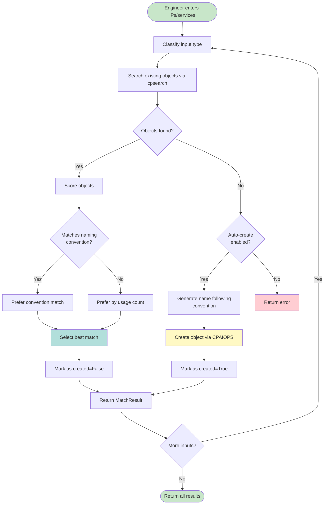
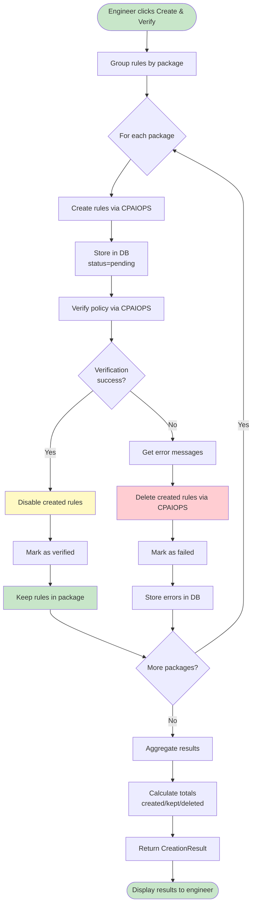
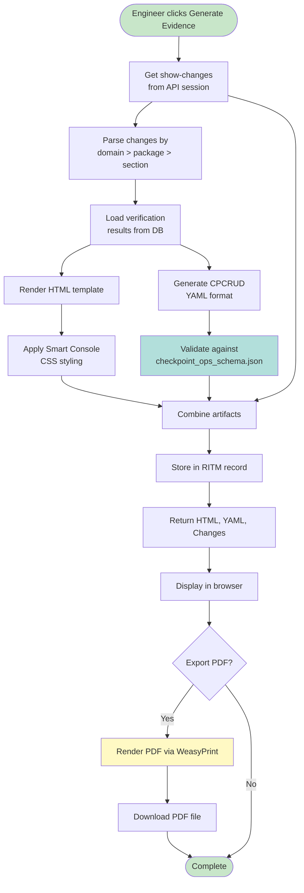
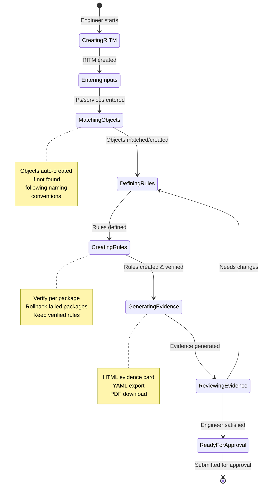
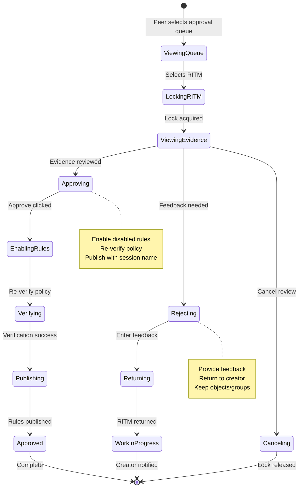
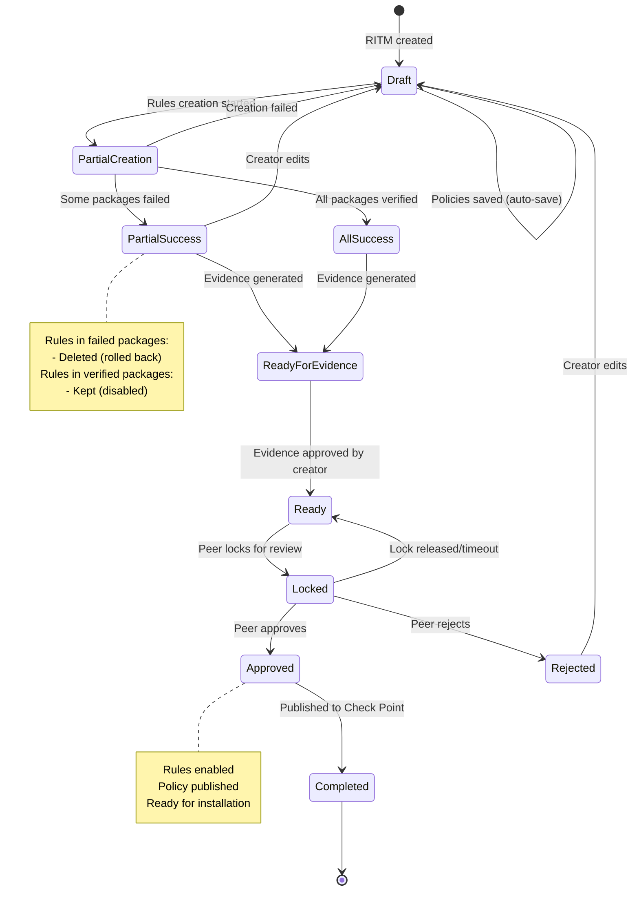
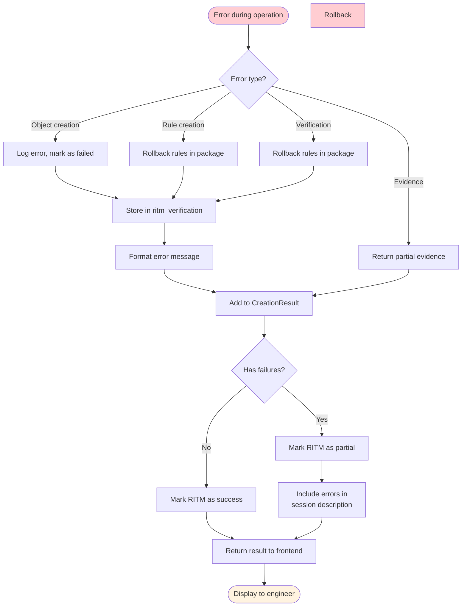
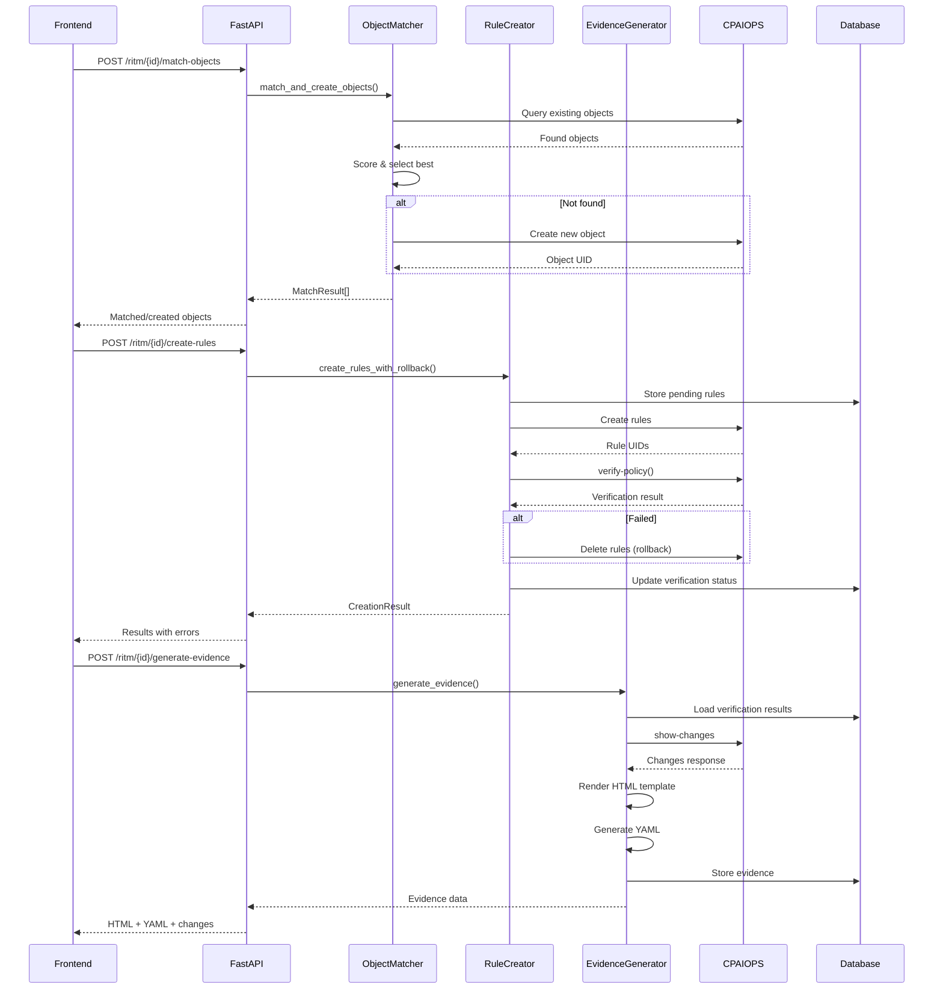
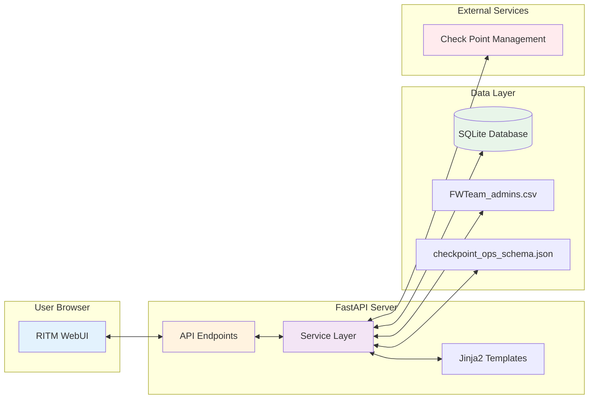

# FPCR Create & Verify Flow Diagrams

**Date:** 2026-04-12

**Related:** [260412-fpcr-flow-design.md](./260412-fpcr-flow-design.md)

---

## 1. Overall Architecture

```mermaid
graph TB
    subgraph Frontend
        FE[RITM Editor UI]
    end

    subgraph API Layer
        R1[POST /ritm/{id}/match-objects]
        R2[POST /ritm/{id}/create-rules]
        R3[POST /ritm/{id}/generate-evidence]
        R4[GET /ritm/{id}/export-pdf]
    end

    subgraph Services
        IL[InitialsLoader]
        OM[ObjectMatcher]
        PV[PolicyVerifier]
        RC[RuleCreator]
        EG[EvidenceGenerator]
    end

    subgraph External
        CPAIOPS[CPAIOPS Client]
        CSV[FWTeam_admins.csv]
        Cache[Cache Service]
        cpsearch[cpsearch]
    end

    FE --> R1
    FE --> R2
    FE --> R3
    FE --> R4

    R1 --> OM
    R2 --> RC
    R3 --> EG

    OM --> cpsearch
    OM --> CPAIOPS
    RC --> PV
    RC --> CPAIOPS
    PV --> CPAIOPS

    EG --> Cache
    IL --> CSV

    style Frontend fill:#e1f5fe
    style API Layer fill:#fff3e0
    style Services fill:#f3e5f5
    style External fill:#e8f5e9
```

---

## 2. Object Matching Flow



---

## 3. Rule Creation Flow



---

## 4. Evidence Generation Flow



---

## 5. Full Engineer 1 Workflow



---

## 6. Peer Review Workflow (Engineer 2)



---

## 7. Database State Transitions



---

## 8. Error Handling Flow



---

## 9. Component Interaction Sequence



---

## 10. Deployment Context


