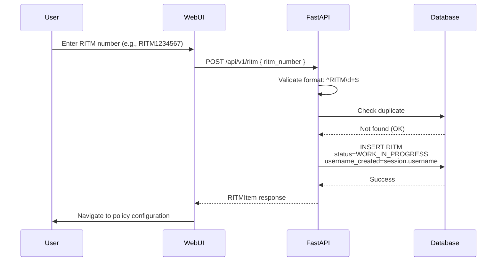
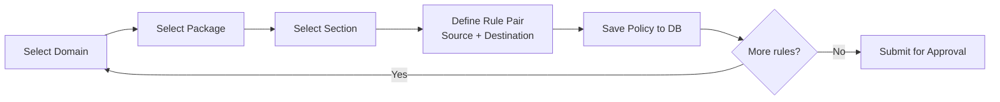
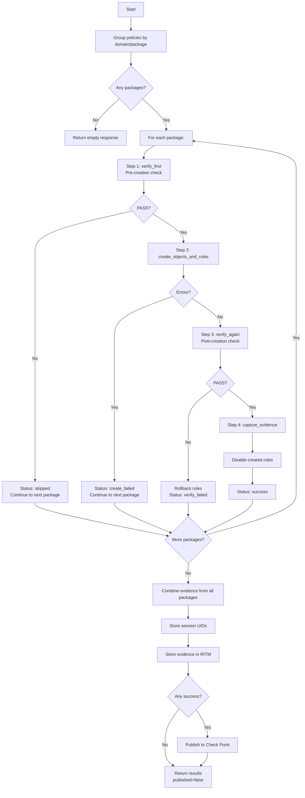
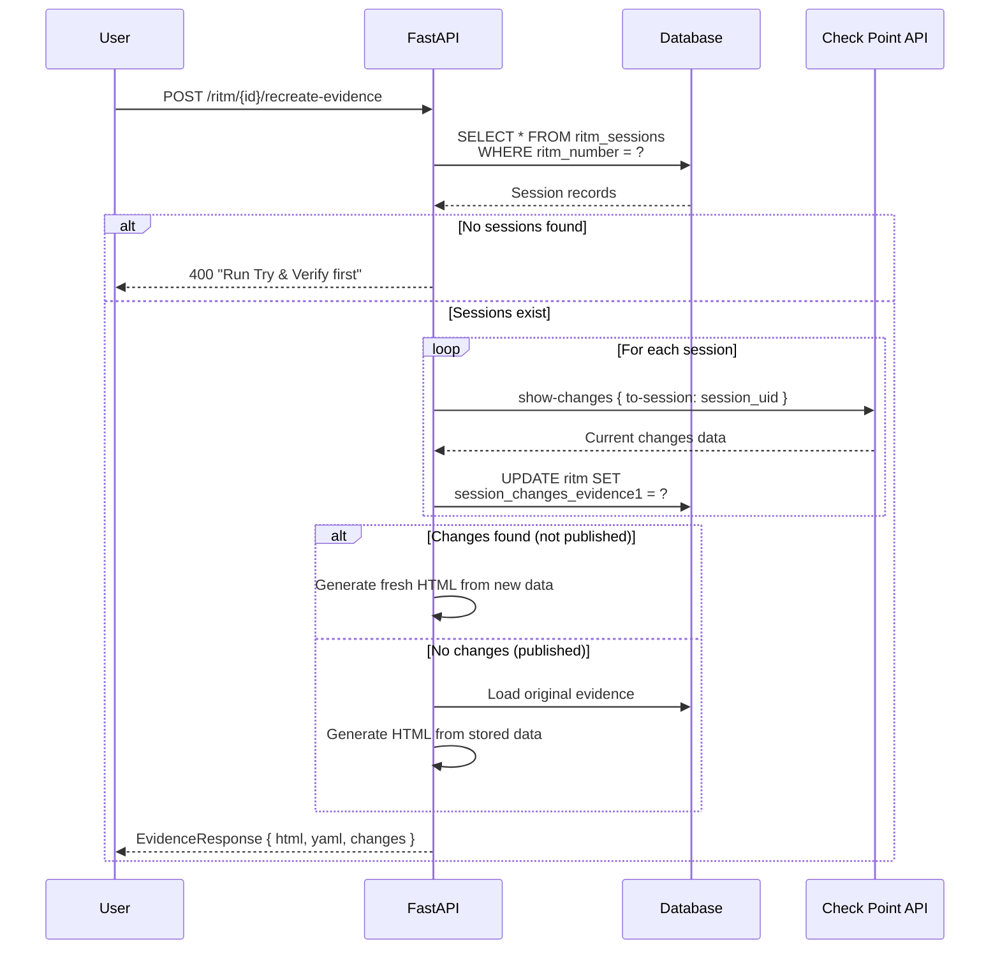

# RITM (Requested Item) Management Flow

> **Purpose:** Documents the complete lifecycle of a RITM – from creation through approval, Try & Verify execution, evidence generation, and publishing to Check Point.

---

## Table of Contents

- [Overview](#overview)
- [Status Lifecycle](#status-lifecycle)
- [Database Schema](#database-schema)
- [Phase 1: RITM Creation](#phase-1-ritm-creation)
- [Phase 2: Policy Configuration](#phase-2-policy-configuration)
- [Phase 3: Approval Workflow](#phase-3-approval-workflow)
- [Phase 4: Try & Verify Execution](#phase-4--try--verify-execution)
- [Phase 5: Evidence Generation](#phase-5-evidence-generation)
- [Phase 6: Evidence Re-Creation](#phase-6-evidence-re-creation)
- [Phase 7: Publishing](#phase-7-publishing)
- [API Endpoints Reference](#api-endpoints-reference)

---

## Overview

The RITM system provides a structured approval workflow for managing firewall policy changes. It enforces separation of duties between requesters and approvers, with automatic rollback on verification failures and comprehensive evidence capture.

### Key Concepts

| Term | Description |
|------|-------------|
| **RITM** | Requested Item – a unique identifier (e.g., `RITM1234567`) for a batch of firewall policy changes |
| **Policy** | An individual rule definition linked to a RITM, containing source/dest IPs, services, action, and position |
| **Package** | A Check Point policy package within a domain (e.g., `Corporate_Security_Policy`) |
| **Domain** | A Check Point management domain (e.g., `SMC User`) |
| **Try & Verify** | The automated workflow that creates objects/rules, verifies them, and captures evidence |
| **Evidence** | A snapshot of session changes (`show-changes` API response) documenting what was modified |

### Architecture Components

```
┌─────────────────────────────────────────────────────────────────────┐
│                        WebUI (React/TypeScript)                     │
│  ┌──────────────┐  ┌──────────────┐  ┌──────────────────────────┐   │
│  │ RitmEdit.tsx │  │RitmApprove.  │  │   Dashboard              │   │
│  │ (Requester)  │  │tsx (Approver)│  │   (List/Filter RITMs)    │   │
│  └──────────────┘  └──────────────┘  └──────────────────────────┘   │
└─────────────────────────┬───────────────────────────────────────────┘
                          │ HTTP/REST
┌─────────────────────────▼───────────────────────────────────────────┐
│                     FastAPI Backend (src/fa/)                       │
│                                                                     │
│  ┌──────────────────────┐   ┌─────────────────────────────────────┐ │
│  │ routes/ritm.py       │   │ routes/ritm_flow.py                 │ │
│  │ • CRUD operations    │   │ • /try-verify                       │ │
│  │ • Status transitions │   │ • /recreate-evidence                │ │
│  │ • Approval locking   │   │ • /plan-yaml                        │ │
│  └──────────┬───────────┘   └──────────────┬──────────────────────┘ │
│             │                              │                        │
│  ┌──────────▼──────────────────────────────▼──────────────────┐     │
│  │              Services Layer                                │     │
│  │  ┌─────────────────────┐  ┌─────────────────────────────┐  │     │
│  │  │ RITMWorkflowService │  │ PackageWorkflowService      │  │     │
│  │  │ • Orchestrates all  │  │ • Per-package operations    │  │     │
│  │  │   packages          │  │ • verify → create → verify  │  │     │
│  │  │ • Combines evidence │  │ • rollback / disable        │  │     │
│  │  └──────────┬──────────┘  └──────────────┬──────────────┘  │     │
│  │             │                            │                 │     │
│  │  ┌──────────▼────────────────────────────▼──────────────┐  │     │
│  │  │              Supporting Services                     │  │     │
│  │  │ • EvidenceGenerator     • SessionChangesPDFGenerator │  │     │
│  │  │ • ObjectMatcher         • PolicyVerifier             │  │     │
│  │  │ • InitialsLoader        • PackageWorkflowService     │  │     │
│  │  └────────────────────────┬─────────────────────────────┘  │     │
│  └───────────────────────────┼────────────────────────────────┘     │
│                              │                                      │
│  ┌───────────────────────────▼─────────────────────────────────┐    │
│  │              Data Access Layer                              │    │
│  │  • models.py (SQLModel tables)                              │    │
│  │  • db.py (AsyncSession engine)                              │    │
│  └───────────────────────────┬─────────────────────────────────┘    │
│                              │                                      │
└──────────────────────────────┼──────────────────────────────────────┘
                               │
               ┌───────────────▼───────────────┐
               │   SQLite Database             │
               │   • ritm                      │
               │   • ritm_policy               │
               │   • ritm_created_objects      │
               │   • ritm_created_rules        │
               │   • ritm_verification         │
               │   • ritm_sessions             │
               └───────────────┬───────────────┘
                               │
               ┌───────────────▼───────────────┐
               │   Check Point API (cpaiops)   │
               │   • show-package              │
               │   • set-access-rule           │
               │   • show-changes              │
               │   • publish                   │
               └───────────────────────────────┘
```

---

## Status Lifecycle

A RITM progresses through four distinct statuses:

```
WORK_IN_PROGRESS (0) → READY_FOR_APPROVAL (1) → APPROVED (2) → COMPLETED (3)
       ↑                                                      │
       └──────────────────────────────────────────────────────┘
                              │
                    (Rejected – feedback provided)
```

| Status | Code | Description | Allowed Transitions |
|--------|------|-------------|---------------------|
| `WORK_IN_PROGRESS` | 0 | Initial state after creation; policies are being configured | → `READY_FOR_APPROVAL` (by creator)<br>→ `WORK_IN_PROGRESS` (by approver, with feedback) |
| `READY_FOR_APPROVAL` | 1 | Creator submits for review | → `APPROVED` (by approver)<br>→ `WORK_IN_PROGRESS` (by approver, with feedback) |
| `APPROVED` | 2 | Approved; ready for Try & Verify execution | → `COMPLETED` (after publishing) |
| `COMPLETED` | 3 | Final state after successful publish | None – terminal state |

### Status Transition Rules

1. **Self-approval prevention:** A user cannot approve their own RITM
2. **Approval lock:** Once an approver locks a RITM, it is locked for `APPROVAL_LOCK_MINUTES` (default: 30 minutes)
3. **Lock expiry:** Expired locks are automatically cleared on next access attempt
4. **Feedback required:** Returning a RITM to the requester requires feedback text

---

## Database Schema

### Core Tables

#### [`RITM`](src/fa/models.py:236) – Main Workflow Record

| Column | Type | Description |
|--------|------|-------------|
| `ritm_number` | String (PK) | Unique identifier, e.g., `RITM1234567` |
| `username_created` | String | Creator's username |
| `date_created` | DateTime | Creation timestamp |
| `date_updated` | DateTime \| NULL | Last update timestamp |
| `date_approved` | DateTime \| NULL | Approval timestamp |
| `username_approved` | String \| NULL | Approver's username |
| `feedback` | String \| NULL | Feedback from approver or requester |
| `status` | Integer | Current status code (see Status Lifecycle) |
| `approver_locked_by` | String \| NULL | Username of current lock holder |
| `approver_locked_at` | DateTime \| NULL | Lock acquisition time |
| `source_ips` | JSON String \| NULL | Input source IP pool |
| `dest_ips` | JSON String \| NULL | Input destination IP pool |
| `services` | JSON String \| NULL | Input services pool |
| `engineer_initials` | String \| NULL | Engineer initials for evidence |
| `session_changes_evidence1` | JSON String \| NULL | Evidence captured during Try & Verify |
| `try_verify_session_uid` | String \| NULL | Session UID where changes were made |

#### [`Policy`](src/fa/models.py:273) – Individual Rule Definition

| Column | Type | Description |
|--------|------|-------------|
| `id` | Integer (PK) | Auto-incrementing primary key |
| `ritm_number` | String (FK → RITM) | Parent RITM reference |
| `rule_name` | String | Rule name in Check Point |
| `comments` | String | Rule comments/description |
| `domain_uid` | String | Check Point domain UID |
| `domain_name` | String | Check Point domain name |
| `package_uid` | String | Policy package UID |
| `package_name` | String | Policy package name |
| `section_uid` | String \| NULL | Access section UID |
| `section_name` | String \| NULL | Access section name |
| `position_type` | String | Position: `top`, `bottom`, or `custom` |
| `position_number` | Integer \| NULL | Custom position number |
| `action` | String | Rule action: `accept` or `drop` |
| `track` | String | Tracking mode: `log` or `none` |
| `source_ips` | JSON String | Array of source IPs |
| `dest_ips` | JSON String | Array of destination IPs |
| `services` | JSON String | Array of services |

#### [`RITMSession`](src/fa/models.py:344) – Session UID Persistence

Stores session UIDs for evidence re-creation after Try & Verify completes.

| Column | Type | Description |
|--------|------|-------------|
| `id` | Integer (PK) | Auto-incrementing primary key |
| `ritm_number` | String (FK → RITM) | Parent RITM reference |
| `domain_name` | String | Domain name |
| `domain_uid` | String | Domain UID |
| `session_uid` | String | Check Point session UID where changes were made |
| `sid` | String | Session ID for the domain |
| `created_at` | DateTime | Record creation timestamp |

#### [`RITMCreatedRule`](src/fa/models.py:311) – Created Rule Tracking

| Column | Type | Description |
|--------|------|-------------|
| `id` | Integer (PK) | Auto-incrementing primary key |
| `ritm_number` | String (FK → RITM) | Parent RITM reference |
| `rule_uid` | String | Check Point rule UID |
| `rule_number` | Integer \| NULL | Rule number in section |
| `package_uid` | String | Package UID |
| `domain_uid` | String | Domain UID |
| `verification_status` | String | `pending`, `verified`, or `failed` |
| `disabled` | Boolean | Whether the rule is disabled |
| `created_at` | DateTime | Creation timestamp |

---

## Phase 1: RITM Creation

### Trigger

A user creates a new RITM via the WebUI (`RitmEdit.tsx`) or API.

### Flow



### Validation Rules

- **Format:** Must match `^RITM\d+$` (e.g., `RITM1234567`)
- **Uniqueness:** No duplicate RITM numbers allowed
- **Authentication:** User must be logged in (session cookie required)

### Key Files

| File | Line | Purpose |
|------|------|---------|
| [`src/fa/routes/ritm.py`](src/fa/routes/ritm.py:249) | 249–284 | `create_ritm()` endpoint |
| [`src/fa/models.py`](src/fa/models.py:30) | 30–36 | `RITMStatus` enum |

---

## Phase 2: Policy Configuration

### Overview

After creation, the user configures individual policy rules (firewall access rules) that will be part of this RITM. Each policy defines a source/destination pair with services, action, and position within an access section.

### Flow



### Data Structure

Each policy is stored as a JSON record in the `ritm_policy` table:

```json
{
  "rule_name": "Allow_Web_Traffic",
  "comments": "Permit HTTP/HTTPS from internal to DMZ",
  "domain_uid": "domain-uid-123",
  "domain_name": "SMC User",
  "package_uid": "package-uid-456",
  "package_name": "Corporate_Security_Policy",
  "section_uid": "section-uid-789",
  "section_name": "Network",
  "position_type": "bottom",
  "action": "accept",
  "track": "log",
  "source_ips": ["10.0.0.0/24"],
  "dest_ips": ["192.168.1.100"],
  "services": ["tcp-443", "tcp-80"]
}
```

---

## Phase 3: Approval Workflow

### Overview

Once policies are configured, the creator submits the RITM for approval. An approver reviews and either approves or returns it with feedback.

### Status Transitions

#### Submitting for Approval

```
WORK_IN_PROGRESS → READY_FOR_APPROVAL
```

| Constraint | Detail |
|------------|--------|
| Who can submit | Only the RITM creator |
| Prerequisite | At least one policy must be defined |

#### Approving a RITM

```
READY_FOR_APPROVAL → APPROVED
```

| Constraint | Detail |
|------------|--------|
| Who can approve | Any authenticated user (not the creator) |
| Lock mechanism | Approver acquires an approval lock for 30 minutes |
| Self-approval | Prevented – creator cannot approve their own RITM |

#### Returning for Changes

```
READY_FOR_APPROVAL → WORK_IN_PROGRESS
```

| Constraint | Detail |
|------------|--------|
| Who can return | Any authenticated user (not the creator) |
| Feedback | Required – must provide explanation text |

### Approval Lock Mechanism

The approval lock prevents concurrent edits by multiple approvers:

1. **Acquisition:** When an approver clicks "Approve," the system attempts to acquire a lock
2. **Lock check:** If another user holds the lock and it hasn't expired, the request is rejected
3. **Lock expiry:** Locks older than `APPROVAL_LOCK_MINUTES` (default: 30 min) are automatically cleared
4. **Release:** The lock is released on approval, rejection, or explicit unlock

### API Endpoints

| Endpoint | Method | Description |
|----------|--------|-------------|
| `/api/v1/ritm/{id}/approve` | POST | Approve the RITM (acquires lock) |
| `/api/v1/ritm/{id}/unlock` | POST | Release approval lock |

### Key Files

| File | Line | Purpose |
|------|------|---------|
| [`src/fa/routes/ritm.py`](src/fa/routes/ritm.py:403) | 403–452 | `approve_ritm()` endpoint |
| [`src/fa/routes/ritm.py`](src/fa/routes/ritm.py:532) | 532–556 | `release_approval_lock()` endpoint |

---

## Phase 4: Try & Verify Execution

### Overview

After approval, the Try & Verify workflow executes automatically. This is the core operational phase where firewall rules are created on Check Point, verified, and either kept or rolled back.

### High-Level Flow



### Per-Package Workflow

Each domain/package combination is processed independently:

#### Step 1: Pre-Creation Verification (`verify_first`)

```python
# src/fa/services/package_workflow.py:75
verifier = PolicyVerifier(self.client)
result = await verifier.verify_policy(
    domain_name=self.info.domain_name,
    package_name=self.info.package_name,
)
```

- Calls Check Point API to verify current policy state
- If verification **fails**: Package is skipped (status: `skipped`)
- If verification **passes**: Proceeds to object/rule creation

#### Step 2: Create Objects and Rules (`create_objects_and_rules`)

```python
# src/fa/services/package_workflow.py:90
matcher = ObjectMatcher(self.client)
rule_mgr = CheckPointRuleManager(self.client)
```

For each policy in the package:

1. **Resolve access layer** from `show-package` API call
2. **Match/create objects:** Source and destination IPs are matched against existing Check Point objects or created as new (hosts, networks, address-ranges)
3. **Create rule:** Access rule is added to the specified section/position with all attributes (source, dest, service, action, track)
4. **Track UIDs:** All created object and rule UIDs are recorded for potential rollback

After creation: The current session UID is captured via `show-session` API call.

#### Step 3: Post-Creation Verification (`verify_again`)

```python
# src/fa/services/package_workflow.py:233
verifier = PolicyVerifier(self.client)
result = await verifier.verify_policy(
    domain_name=self.info.domain_name,
    package_name=self.info.package_name,
)
```

- Re-verifies policy state after changes
- If verification **fails**: Triggers rollback (Step 4a)
- If verification **passes**: Proceeds to evidence capture (Step 4b)

#### Step 4a: Rollback (on Verify failure)

```python
# src/fa/services/package_workflow.py:248
rule_mgr = CheckPointRuleManager(self.client)
for rule_uid in created_rule_uids:
    await rule_mgr.delete(mgmt_name, domain, rule_type="access-rule", key={"uid": rule_uid})
```

- All rules created during Step 2 are deleted from Check Point
- Package status is set to `verify_failed`
- Processing continues with the next package

#### Step 4b: Success Path (on Verify success)

1. **Capture evidence** (`capture_evidence`) – See Phase 5
2. **Disable rules** (`disable_rules`) – Newly created rules are disabled in Check Point

```python
# src/fa/services/package_workflow.py:268
await self.client.api_call(
    mgmt_name=self.mgmt_name,
    domain=self.info.domain_name,
    command="set-access-rule",
    payload={"uid": rule_uid, "enabled": False},
)
```

### Orchestration (`RITMWorkflowService.try_verify`)

The [`RITMWorkflowService`](src/fa/services/ritm_workflow_service.py:27) orchestrates the entire process:

1. Groups policies by unique (domain_uid, package_uid) combinations
2. Iterates through each package, executing the per-package workflow
3. Combines evidence from all successful packages
4. Stores session UIDs in `ritm_sessions` table for re-creation
5. Stores combined evidence in RITM record (`session_changes_evidence1`)
6. Publishes to Check Point if any packages succeeded

### API Endpoint

| Endpoint | Method | Description |
|----------|--------|-------------|
| `/api/v1/ritm/{id}/try-verify` | POST | Execute full Try & Verify workflow |

### Response Structure

```json
{
  "results": [
    {
      "package": "Corporate_Security_Policy",
      "status": "success",
      "rules_created": 5,
      "objects_created": 10,
      "errors": []
    }
  ],
  "evidence_pdf": "<base64-encoded PDF>",
  "evidence_html": "<HTML evidence card>",
  "published": true,
  "session_changes": { ... }
}
```

### Key Files

| File | Line | Purpose |
|------|------|---------|
| [`src/fa/routes/ritm_flow.py`](src/fa/routes/ritm_flow.py:293) | 293–339 | `try_verify_ritm()` endpoint |
| [`src/fa/services/ritm_workflow_service.py`](src/fa/services/ritm_workflow_service.py:43) | 43–167 | `RITMWorkflowService.try_verify()` |
| [`src/fa/services/package_workflow.py`](src/fa/services/package_workflow.py:90) | 90–231 | `PackageWorkflowService.create_objects_and_rules()` |

---

## Phase 5: Evidence Generation

### Overview

Evidence is a comprehensive snapshot of all changes made during Try & Verify. It captures the Check Point `show-changes` API response, documenting every object and rule modification.

### When Evidence Is Generated

| Event | Evidence Captured |
|-------|------------------|
| **Try & Verify** | Combined evidence from all successful packages is captured after all packages complete |
| **Per-package** | Each package captures its own `show-changes` response during `capture_evidence()` step |

### Evidence Structure

The combined evidence (`session_changes`) contains:

```json
{
  "apply_sessions": {
    "domain_name": {
      "uid": "...",
      "sid": "...",
      "name": "..."
    }
  },
  "apply_session_trace": [
    {
      "domain": "SMC User",
      "package": "Corporate_Security_Policy",
      "session_uid": "abc-123-def",
      "sid": "xyz-789"
    }
  ],
  "domain_changes": {
    "SMC User": {
      "tasks": [
        {
          "task-name": "...",
          "task-details": [
            {
              "changes": [
                {
                  "operations": {
                    "added-objects": [...],
                    "modified-objects": [...],
                    "deleted-objects": []
                  }
                }
              ]
            }
          ]
        }
      ]
    }
  },
  "show_changes_requests": {},
  "errors": []
}
```

### Evidence Artifacts

Two formats are generated:

| Format | Generator | Description |
|--------|-----------|-------------|
| **HTML** | [`SessionChangesPDFGenerator.generate_html()`](src/fa/services/session_changes_pdf.py:35) | Jinja2-rendered HTML evidence card with formatted tables |
| **PDF** | [`SessionChangesPDFGenerator.generate_pdf()`](src/fa/services/session_changes_pdf.py:100+) | ReportLab-generated PDF document for archival |

### Evidence Storage

Evidence is stored in two places:

1. **RITM record:** `session_changes_evidence1` column (JSON string)
2. **Session records:** Individual entries in `ritm_sessions` table with session UIDs

The session UIDs enable evidence re-creation even after the original session has been published or expired.

### Key Files

| File | Line | Purpose |
|------|------|---------|
| [`src/fa/services/session_changes_pdf.py`](src/fa/services/session_changes_pdf.py:26) | 26–758 | `SessionChangesPDFGenerator` class |
| [`src/fa/templates/session_changes.html`](src/fa/templates/session_changes.html) | – | Jinja2 HTML template for evidence rendering |

---

## Phase 6: Evidence Re-Creation

### Overview

Evidence can be re-generated at any time after Try & Verify by fetching fresh `show-changes` data from Check Point using the stored session UIDs. This is useful when manual changes were made to the firewall after the original execution.

### When to Use

| Scenario | Behavior |
|----------|----------|
| **Session not yet published** | Fresh `show-changes` returns current pending changes |
| **Session was published** | Check Point clears the session; falls back to originally stored evidence |

### Flow



### API Endpoint

| Endpoint | Method | Description |
|----------|--------|-------------|
| `/api/v1/ritm/{id}/recreate-evidence` | POST | Re-generate evidence from stored session UIDs |

### Response Structure

```json
{
  "html": "<HTML evidence card>",
  "yaml": "",
  "changes": {
    "SMC User": { ... }
  }
}
```

### Key Files

| File | Line | Purpose |
|------|------|---------|
| [`src/fa/routes/ritm_flow.py`](src/fa/routes/ritm_flow.py:342) | 342–507 | `recreate_evidence()` endpoint |

---

## Phase 7: Publishing

### Overview

Publishing applies all pending changes in Check Point sessions to the live firewall policy. This is triggered automatically after successful Try & Verify (when any package succeeds).

### When Publishing Occurs

| Condition | Action |
|-----------|--------|
| **Try & Verify completes with ≥1 success** | Auto-publish is triggered |
| **All packages fail** | No publish; RITM remains in `APPROVED` status |

### Publish Process

```python
# src/fa/services/ritm_workflow_service.py:307
session_name = f"{self.ritm_number} {self.username} Created"

for domain_name in domains:
    await self.client.api_call(
        mgmt_name=self.mgmt_name,
        domain=domain_name,
        command="publish",
        payload={},
    )
```

After successful publish:

1. RITM status is updated to `COMPLETED`
2. Rules remain disabled (they were disabled during Try & Verify)
3. Evidence reflects the state at time of Try & Verify

### Manual Publish

A manual publish endpoint exists for cases where automatic publishing needs to be re-triggered:

| Endpoint | Method | Description |
|----------|--------|-------------|
| `/api/v1/ritm/{id}/publish` | POST | Manually publish an approved RITM |

**Constraint:** Only RITMs with `APPROVED` status can be published.

### Key Files

| File | Line | Purpose |
|------|------|---------|
| [`src/fa/services/ritm_workflow_service.py`](src/fa/services/ritm_workflow_service.py:307) | 307–335 | `_publish_session()` method |
| [`src/fa/routes/ritm.py`](src/fa/routes/ritm.py:559) | 559–621 | `publish_ritm()` endpoint |

---

## API Endpoints Reference

### RITM CRUD (`/api/v1/ritm`)

| Endpoint | Method | Description | Auth Required |
|----------|--------|-------------|---------------|
| `/api/v1/ritm` | POST | Create a new RITM | Yes |
| `/api/v1/ritm` | GET | List all RITMs (with optional `status` and `username` filters) | Yes |
| `/api/v1/ritm/{id}` | GET | Get RITM with associated policies | Yes |
| `/api/v1/ritm/{id}` | PUT | Update RITM status or feedback | Yes |

### Approval Workflow (`/api/v1/ritm/{id}`)

| Endpoint | Method | Description | Auth Required |
|----------|--------|-------------|---------------|
| `/api/v1/ritm/{id}/approve` | POST | Acquire approval lock and approve | Yes |
| `/api/v1/ritm/{id}/unlock` | POST | Release approval lock | Yes |
| `/api/v1/ritm/{id}/publish` | POST | Manually publish approved RITM | Yes |

### Try & Verify Flow (`/api/v1/ritm/{id}`)

| Endpoint | Method | Description | Auth Required |
|----------|--------|-------------|---------------|
| `/api/v1/ritm/{id}/try-verify` | POST | Execute full Try & Verify workflow | Yes |
| `/api/v1/ritm/{id}/recreate-evidence` | POST | Re-generate evidence from stored session UIDs | Yes |
| `/api/v1/ritm/{id}/plan-yaml` | POST | Generate plan-only CPCRUD YAML from policies | Yes |

### Request/Response Examples

#### Create RITM

```http
POST /api/v1/ritm
Content-Type: application/json
Cookie: session_id=abc123

{ "ritm_number": "RITM1234567" }
```

#### Try & Verify Response

```json
{
  "results": [
    {
      "package": "Corporate_Security_Policy",
      "status": "success",
      "rules_created": 5,
      "objects_created": 10,
      "errors": []
    },
    {
      "package": "Guest_Network_Policy",
      "status": "skipped",
      "errors": ["Policy verification failed: rule conflict detected"]
    }
  ],
  "evidence_pdf": "JVBERi0xLjQKJe...",
  "evidence_html": "<!DOCTYPE html>...",
  "published": true,
  "session_changes": { ... }
}
```

---

## File Reference

### Backend Routes

| File | Purpose |
|------|---------|
| [`src/fa/routes/ritm.py`](src/fa/routes/ritm.py) | RITM CRUD, approval workflow, publish |
| [`src/fa/routes/ritm_flow.py`](src/fa/routes/ritm_flow.py) | Try & Verify, evidence re-creation, plan YAML |

### Services

| File | Purpose |
|------|---------|
| [`src/fa/services/ritm_workflow_service.py`](src/fa/services/ritm_workflow_service.py) | Top-level Try & Verify orchestrator |
| [`src/fa/services/package_workflow.py`](src/fa/services/package_workflow.py) | Per-package workflow (verify → create → verify → rollback/disable) |
| [`src/fa/services/evidence_generator.py`](src/fa/services/evidence_generator.py) | HTML evidence card and YAML export generation |
| [`src/fa/services/session_changes_pdf.py`](src/fa/services/session_changes_pdf.py) | PDF evidence generation from session changes data |
| [`src/fa/services/object_matcher.py`](src/fa/services/object_matcher.py) | Check Point object matching/creation |
| [`src/fa/services/policy_verifier.py`](src/fa/services/policy_verifier.py) | Policy verification against Check Point |

### Data Models

| File | Purpose |
|------|---------|
| [`src/fa/models.py`](src/fa/models.py) | All SQLModel table definitions and Pydantic API models |

### Frontend Pages

| File | Purpose |
|------|---------|
| `webui/src/pages/RitmEdit.tsx` | RITM creation and policy configuration (requester view) |
| `webui/src/pages/RitmApprove.tsx` | RITM approval page (approver view) |

### Database Tables

| Table | Purpose |
|-------|---------|
| `ritm` | Main workflow record |
| `ritm_policy` | Individual rule definitions |
| `ritm_sessions` | Session UIDs for evidence re-creation |
| `ritm_created_objects` | Track created objects (host, network, etc.) |
| `ritm_created_rules` | Track created rules with verification status |
| `ritm_verification` | Per-package verification results |
