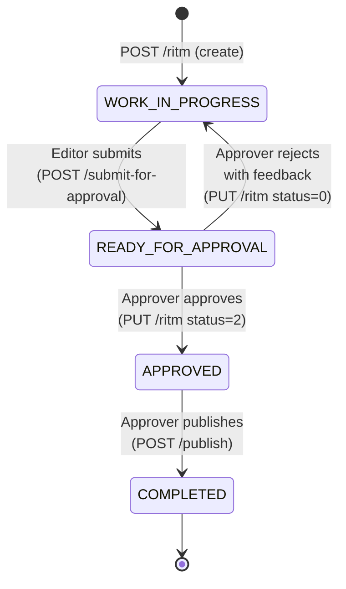
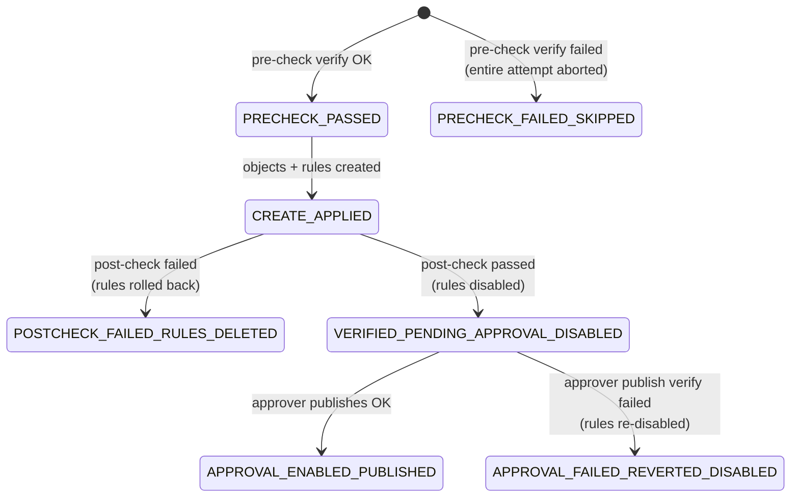

# RITM Workflow Guide

> **Purpose:** Complete reference for the RITM (Requested Item) lifecycle – from creation through correction cycles, approval, and final publishing to Check Point.

---

## Table of Contents

- [Overview](#overview)
- [State Machine](#state-machine)
- [Workflow Sequence](#workflow-sequence)
- [Step-by-Step Procedure](#step-by-step-procedure)
  - [1. Create RITM and Configure Policies](#1-create-ritm-and-configure-policies)
  - [2. Pre-Verify](#2-pre-verify)
  - [3. Try and Verify](#3-try-and-verify)
  - [4. Submit for Approval](#4-submit-for-approval)
  - [5. Approver Review](#5-approver-review)
  - [6. Rejection and Correction Cycle](#6-rejection-and-correction-cycle)
  - [7. Approval and Publishing](#7-approval-and-publishing)
- [Guardrails and Separation of Duties](#guardrails-and-separation-of-duties)
- [Evidence Structure](#evidence-structure)
- [Per-Package Attempt States](#per-package-attempt-states)

---

## Overview

The RITM system manages firewall policy change requests from initiation to live deployment. It enforces strict separation of duties between editors (engineers making the change) and approvers (engineers reviewing it), with full evidence capture at every step.

Key design principles:

- **Nobody approves their own work.** Anyone who edits a RITM is permanently blocked from approving it.
- **Nobody edits after reviewing.** Anyone who approves or rejects becomes permanently blocked from editing.
- **Rules go live only after approval.** Rules are created and then immediately disabled; enabling happens only when the approver publishes.
- **All-or-nothing per attempt.** If the pre-check fails, the entire Try & Verify attempt is aborted.
- **Evidence is never consolidated.** Each Check Point management session is stored separately; the UI groups them, but the raw records are individual.

---

## State Machine

The RITM record carries one of four top-level statuses:



| Status               | Code | Who Sets It                                | Preconditions                                                             |
| -------------------- | ---- | ------------------------------------------ | ------------------------------------------------------------------------- |
| `WORK_IN_PROGRESS`   | 0    | System (on create) or Approver (on reject) | –                                                                         |
| `READY_FOR_APPROVAL` | 1    | Editor via `/submit-for-approval`          | Must hold editor lock; ≥1 package in `VERIFIED_PENDING_APPROVAL_DISABLED` |
| `APPROVED`           | 2    | Approver via `PUT /ritm`                   | RITM in `READY_FOR_APPROVAL`; caller not in `ritm_editors`                |
| `COMPLETED`          | 3    | System after `/publish` succeeds           | RITM in `APPROVED`                                                        |

Rejection always requires feedback text. Without it the API returns HTTP 400.

---

## Workflow Sequence

The full lifecycle – including a rejection and correction cycle – is shown below.

```mermaid
sequenceDiagram
    actor E as Editor
    actor A as Approver
    participant API as FastAPI
    participant DB as Database
    participant CP as Check Point

    %% ── Creation & configuration ──────────────────────────────────────
    E->>API: POST /ritm  { ritm_number }
    API->>DB: INSERT ritm (status=0, editor_locked_by=editor)
    API->>DB: INSERT ritm_editors (editor)
    API-->>E: RITM created, editor lock acquired

    E->>API: POST /ritm/{id}/policy  [ rule definitions ]
    API->>DB: REPLACE ritm_policy rows
    API-->>E: Policies saved

    %% ── Pre-verify ────────────────────────────────────────────────────
    E->>API: POST /ritm/{id}/pre-verify
    API->>CP: verify-policy (per domain/package)
    CP-->>API: pass / fail per package
    API-->>E: GroupedVerifyResponse (all_passed + per-package errors)

    %% ── Try & Verify ──────────────────────────────────────────────────
    E->>API: POST /ritm/{id}/try-verify
    note over API: Groups policies by (domain, package)<br/>Computes attempt number

    loop For each package (sequentially)
        API->>CP: verify-policy  [pre-check]
        alt pre-check fails
            note over API: Abort entire attempt (all-or-nothing)
            API-->>E: TryVerifyResponse (pre-check failed)
        else pre-check passes
            API->>DB: INSERT ritm_package_attempt  state=PRECHECK_PASSED
            API->>CP: Match / create network objects
            API->>CP: Create access rules (enabled=true)
            API->>DB: INSERT ritm_created_objects / ritm_created_rules
            API->>CP: verify-policy  [post-check]
            alt post-check fails
                API->>CP: delete created rules  [rollback]
                API->>DB: UPDATE ritm_package_attempt  state=POSTCHECK_FAILED_RULES_DELETED
            else post-check passes
                API->>CP: set-access-rule enabled=false  [disable rules]
                API->>CP: show-changes  [capture evidence]
                API->>DB: INSERT ritm_evidence_sessions  (session_type="initial")
                API->>DB: UPDATE ritm_package_attempt  state=VERIFIED_PENDING_APPROVAL_DISABLED
            end
        end
    end

    API-->>E: TryVerifyResponse (per-package results + evidence HTML/PDF)

    %% ── Submit for approval ───────────────────────────────────────────
    E->>API: POST /ritm/{id}/submit-for-approval
    note over API: Requires editor lock<br/>≥1 package VERIFIED_PENDING_APPROVAL_DISABLED
    API->>DB: INSERT/UPDATE ritm_edit_snapshot (rules + objects JSON)
    API->>CP: set-access-rule enabled=false  [safety double-check]
    API->>CP: publish  [publish disabled rules per domain]
    API->>DB: UPDATE ritm  status=READY_FOR_APPROVAL
    API-->>E: PublishResponse

    %% ── Approver reviews ──────────────────────────────────────────────
    A->>API: POST /ritm/{id}/lock  [acquire approver lock]
    API->>DB: UPDATE ritm  approver_locked_by=approver
    API-->>A: Lock acquired

    A->>API: GET /ritm/{id}/evidence-history
    API->>DB: SELECT ritm_evidence_sessions grouped by domain→package→attempt
    API-->>A: EvidenceHistoryResponse

    %% ── Rejection path ────────────────────────────────────────────────
    A->>API: PUT /ritm/{id}  { status: 0, feedback: "..." }
    API->>DB: INSERT ritm_reviewers (action="rejected")
    API->>DB: UPDATE ritm  status=WORK_IN_PROGRESS, editor_locked_by=NULL
    note over DB: Editor lock cleared so a new or the same<br/>editor can take over
    API-->>A: RITM returned for correction

    %% ── Correction cycle ──────────────────────────────────────────────
    E->>API: POST /ritm/{id}/editor-lock
    note over API: Blocked if caller is in ritm_reviewers
    API->>DB: UPDATE ritm  editor_locked_by=editor
    API->>DB: INSERT ritm_editors (editor) [idempotent, ON CONFLICT IGNORE]
    API-->>E: Lock acquired (edit snapshot saved for diff display)

    note over E: Edit policies, fix issues per feedback
    E->>API: POST /ritm/{id}/policy  [ updated rules ]

    E->>API: POST /ritm/{id}/try-verify
    note over API: attempt = MAX(prev) + 1<br/>session_type = "correction"
    API->>CP: [same verify → create → verify → disable flow]
    API->>DB: INSERT ritm_evidence_sessions  (session_type="correction")
    API-->>E: TryVerifyResponse

    E->>API: POST /ritm/{id}/submit-for-approval
    API->>DB: UPDATE ritm  status=READY_FOR_APPROVAL
    API-->>E: Resubmitted

    %% ── Approval & publish ────────────────────────────────────────────
    A->>API: PUT /ritm/{id}  { status: 2 }
    note over API: Caller must NOT be in ritm_editors
    API->>DB: INSERT ritm_reviewers (action="approved")
    API->>DB: UPDATE ritm  status=APPROVED, username_approved, date_approved
    API-->>A: RITM approved

    A->>API: POST /ritm/{id}/publish
    loop For each package
        API->>CP: set-access-rule enabled=true  [enable rules]
        API->>CP: verify-policy  [final check]
        alt verify fails
            API->>CP: set-access-rule enabled=false  [re-disable]
            API->>DB: UPDATE ritm_package_attempt  state=APPROVAL_FAILED_REVERTED_DISABLED
        else verify passes
            API->>CP: show-changes  [approval evidence]
            API->>DB: INSERT ritm_evidence_sessions  (session_type="approval")
            API->>CP: publish  [go live]
            API->>DB: UPDATE ritm_package_attempt  state=APPROVAL_ENABLED_PUBLISHED
        end
    end
    API->>DB: UPDATE ritm  status=COMPLETED
    API-->>A: PublishResponse
```



---

## Step-by-Step Procedure

### 1. Create RITM and Configure Policies

**Who:** Any authenticated engineer (becomes the first editor).

**Actions:**

1. `POST /ritm` with `{ "ritm_number": "RITM0001234" }`.
   - RITM number must match `^RITM\d+$`.
   - Creator is automatically added to `ritm_editors` and acquires the **editor lock**.
   - Status set to `WORK_IN_PROGRESS`.

2. `POST /ritm/{id}/policy` to save rule definitions.
   - Replaces all existing policies for this RITM in one shot.
   - Each rule specifies: domain, package, section, position, action, track, source IPs, dest IPs, services.
   - The calling user is recorded as an editor (`ritm_editors`) on every save.

3. Optionally `POST /ritm/{id}/pools` to persist the raw IP/service input pools for UI state.

**Editor lock:** The lock expires after `APPROVAL_LOCK_MINUTES` (default 30 min). Another editor can acquire it after expiry. Only one person can hold it at a time.

---

### 2. Pre-Verify

**Who:** Editor (while holding editor lock, but lock is not required).

**Action:** `POST /ritm/{id}/pre-verify`

Runs `verify-policy` on Check Point for every unique (domain, package) combination in the RITM's policies. Returns a `GroupedVerifyResponse` with:

- `all_passed`: boolean.
- Per-package result with errors/warnings.

This is a **read-only, non-destructive check** – no objects or rules are created. Use it to validate that the current policy state is healthy before running Try & Verify. Alternatively a streaming version is available at `GET /ritm/{id}/verify-policy/stream` (SSE).

---

### 3. Try and Verify

**Who:** Editor.

**Action:** `POST /ritm/{id}/try-verify`

This is the core automation step. It processes all (domain, package) combinations **sequentially**, and follows an **all-or-nothing** rule at attempt level: if the pre-check fails on any package, the entire attempt is aborted immediately.

For each package:

| Step | What Happens | On Failure |
|------|-------------|------------|
| **Pre-check** | `verify-policy` to confirm baseline is clean | Abort entire attempt; no further packages processed |
| **Create objects** | Match existing CP objects by IP, create new ones if no match | Skip this package, continue to next |
| **Create rules** | Add access rules (enabled=true) to the specified section/position | Skip this package, continue to next |
| **Post-check** | `verify-policy` again to confirm new rules are valid | Rollback: delete all rules just created; continue to next package |
| **Disable rules** | `set-access-rule enabled=false` for each created rule | – |
| **Capture evidence** | `show-changes` → stored as a session row | – |

**Object naming convention:**

| IP Type | Name Format |
|---------|-------------|
| Host | `Host_<ip>` |
| Network | `Net_<subnet>_<mask>` |
| Address range | `IPR_<first>_to_<last>` |

Objects are **never deleted** on failure – they are safe to keep and will be reused by future attempts.

**Attempt tracking:** Each run increments the attempt counter. Per-package states are recorded in `ritm_package_attempt` (one row per attempt × domain × package).

**Response includes:** per-package results, evidence as HTML and base64 PDF, `published` flag.

---

### 4. Submit for Approval

**Who:** Editor, must hold the editor lock.

**Action:** `POST /ritm/{id}/submit-for-approval`

**Preconditions:**

- Caller holds the editor lock.
- At least one package has state `VERIFIED_PENDING_APPROVAL_DISABLED` in the latest attempt.

**What happens:**

1. An **edit snapshot** is saved (`ritm_edit_snapshot`) – the current rules and objects JSON. This is used later to show a diff to the approver during correction cycles.
2. All created rules are re-checked and forced to `enabled=false` as a safety measure.
3. The Check Point session is **published** per domain (the disabled rules are committed to the management server).
4. RITM status is moved to `READY_FOR_APPROVAL`.
5. The editor lock is **not** released – it stays until the RITM is either approved or rejected.

---

### 5. Approver Review

**Who:** Any authenticated user who is **not** in `ritm_editors` for this RITM.

**Actions:**

1. `POST /ritm/{id}/lock` – acquire the approver lock (30-minute TTL).
2. Review evidence:
   - `GET /ritm/{id}/evidence-history` – full session history grouped by domain → package → attempt.
   - `GET /ritm/{id}/session-html` or `session-pdf` – rendered evidence card for a given attempt.
3. Optionally `POST /ritm/{id}/pre-verify` to re-check current policy state.
4. Choose: **approve** or **reject**.

---

### 6. Rejection and Correction Cycle

**Who:** Approver rejects; then a (possibly new) editor corrects.

#### Rejection

`PUT /ritm/{id}  { "status": 0, "feedback": "Reason..." }`

- `feedback` is mandatory; missing it returns HTTP 400.
- The caller is recorded permanently in `ritm_reviewers` with `action="rejected"`.
- The editor lock is **cleared** – this allows a different engineer to pick up the work.
- Status returns to `WORK_IN_PROGRESS`.

#### Taking the RITM for Correction

Any engineer who is **not** in `ritm_reviewers` can acquire the editor lock:

`POST /ritm/{id}/editor-lock`

- Blocked with HTTP 400 if the caller already has an entry in `ritm_reviewers` for this RITM.
- On acquisition, an edit snapshot is saved for diffing against the previous state.
- The caller is added to `ritm_editors` (idempotent).

The correction editor then:

1. Updates policies (`POST /ritm/{id}/policy`).
2. Runs `POST /ritm/{id}/try-verify` – this time with `session_type="correction"` in evidence.
3. Runs `POST /ritm/{id}/submit-for-approval` again.

The approver who rejected **cannot** now take the editor lock; they are permanently in `ritm_reviewers`. A **different** approver must review the corrected RITM (or the same one if they were not the one who rejected – there is no "same approver on next cycle" restriction, only the "never edit after reviewing" rule).

---

### 7. Approval and Publishing

#### Approving

`PUT /ritm/{id}  { "status": 2 }`

- Caller must **not** appear in `ritm_editors` for this RITM.
- Caller is added to `ritm_reviewers` with `action="approved"`.
- `date_approved` and `username_approved` are recorded.
- Approver lock is cleared.
- Status → `APPROVED`.

#### Publishing

`POST /ritm/{id}/publish`

Only callable when status is `APPROVED`. For each (domain, package):

| Step | What Happens | On Failure |
|------|-------------|------------|
| **Enable rules** | `set-access-rule enabled=true` | – |
| **Verify policy** | Final `verify-policy` | Re-disable rules; record `APPROVAL_FAILED_REVERTED_DISABLED`; continue to next package |
| **Capture approval evidence** | `show-changes` → stored as `session_type="approval"` | – |
| **Publish** | `publish` command to Check Point | – |
| **Record state** | `APPROVAL_ENABLED_PUBLISHED` in `ritm_package_attempt` | – |

After all packages are processed, status → `COMPLETED`. Rules that failed final verification remain **disabled** in the policy.

---

## Guardrails and Separation of Duties

The system enforces two permanent, non-reversible role blocks per RITM:

### Permanent Editor Block

Once a user approves **or** rejects a RITM, they are written to `ritm_reviewers`.

Any subsequent attempt to acquire the **editor lock** returns HTTP 400.

```
ritm_reviewers (action="approved"|"rejected") → editor lock blocked forever
```

### Permanent Approver Block

Once a user edits policies or holds the editor lock, they are written to `ritm_editors`.

Any subsequent attempt to **approve** or acquire the **approver lock** returns HTTP 400.

```
ritm_editors → approve blocked forever, approver lock blocked forever
```

### Summary Table

| Action | Who Can Do It | Hard Block |
|--------|--------------|------------|
| Create RITM | Anyone | – |
| Acquire editor lock | Anyone not in `ritm_reviewers` for this RITM | `ritm_reviewers` entry → blocked |
| Edit policies / pools | Anyone holding editor lock | Lock required |
| Pre-verify | Anyone | – |
| Try & Verify | Anyone | – |
| Submit for approval | Editor holding lock, ≥1 verified package | Lock + state required |
| Acquire approver lock | Anyone not in `ritm_editors` for this RITM | `ritm_editors` entry → blocked |
| Approve RITM | Anyone not in `ritm_editors` | `ritm_editors` entry → blocked |
| Reject RITM | Anyone not in `ritm_editors` | `ritm_editors` entry → blocked |
| Publish | Anyone; RITM must be APPROVED | Status check |

Both role tables accumulate across rejection cycles. A user who edits on attempt 1 and then someone else edits on attempt 3 – **both** are in `ritm_editors` and **both** are blocked from approving.

---

## Evidence Structure

Evidence is **not consolidated**. Each successful package execution stores one row in `ritm_evidence_sessions`. Nothing is merged or summarized – the raw `show-changes` JSON is kept per session. The UI groups sessions for display.

### Evidence Session Row

| Column | Description |
|--------|-------------|
| `ritm_number` | Parent RITM |
| `attempt` | Which Try & Verify run (1, 2, 3, …) |
| `domain_name` / `domain_uid` | Check Point domain |
| `package_name` / `package_uid` | Policy package |
| `session_uid` | Check Point session identifier (`show-changes` key) |
| `sid` | Management server session ID |
| `session_type` | `initial`, `correction`, or `approval` |
| `session_changes` | Raw JSON blob from `show-changes` API |
| `created_at` | Row insertion timestamp |

### Session Types

| Type | When Created |
|------|-------------|
| `initial` | First successful Try & Verify (attempt = 1) |
| `correction` | Any subsequent Try & Verify (attempt > 1) |
| `approval` | When the approver publishes – one row per successfully published package |

### Evidence Hierarchy for Display

```
Domain: SMC User
  └── Package: Corporate_Security_Policy
        ├── Attempt 1 (initial) – session_uid: abc-111
        ├── Attempt 2 (correction) – session_uid: abc-222
        └── Attempt 3 (approval) – session_uid: abc-333
```

### Evidence Endpoints

| Endpoint | Description |
|----------|-------------|
| `GET /ritm/{id}/evidence-history` | Full grouped hierarchy |
| `GET /ritm/{id}/session-html?attempt=N` | Rendered HTML evidence card for attempt N |
| `GET /ritm/{id}/session-pdf?attempt=N` | PDF download for attempt N |
| `POST /ritm/{id}/recreate-evidence` | Re-fetch `show-changes` from CP and refresh stored JSON |

Evidence re-creation calls the Check Point API using stored `session_uid` values. If a session has already been published, Check Point clears it; the stored JSON is used as a fallback.

---

## Per-Package Attempt States

`ritm_package_attempt` tracks fine-grained state for every (attempt, domain, package) combination.

This table is used both for progress tracking during a run and for the approver to understand what happened in each cycle.



| State | Meaning |
|-------|---------|
| `PRECHECK_PASSED` | Pre-check verify passed; object/rule creation in progress |
| `PRECHECK_FAILED_SKIPPED` | Pre-check verify failed; entire attempt was aborted |
| `CREATE_APPLIED` | Objects and rules created; post-check in progress |
| `POSTCHECK_FAILED_RULES_DELETED` | Post-check failed; all created rules deleted (rollback) |
| `VERIFIED_PENDING_APPROVAL_DISABLED` | Rules exist, are disabled, published; awaiting approver |
| `APPROVAL_ENABLED_PUBLISHED` | Approver enabled, verified, published – rules live |
| `APPROVAL_FAILED_REVERTED_DISABLED` | Approver's final verify failed; rules re-disabled |
